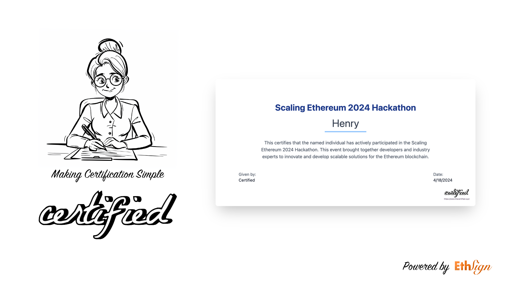

  <h1> Certified </h1>

  <strong>
    Simplifying Certification on Blockchain.
  </strong>

# What is Certified?

Simplifying Certification on Blockchain. Facilitate on-chain certificate issuance and management for customers without a wallet using Sign Protocol. Certificates can be shared to LinkedIn, X, and more platforms effortlessly with one click.

# Introduction

Certifications, especially those verifying professional skills, play a crucial role in employment and professional networking. They serve as third-party validation of an individual's capabilities and previous experience. The application of certifications on the blockchain presents a significant opportunity, as blockchain's decentralization and immutability enhance the authenticity and reliability of these certificates. Furthermore, blockchain can provide ongoing services for certificate holders, such as access to communities and potential income streams, linked to their blockchain addresses. However, we recognize that usability is a major barrier to integrating certifications with blockchain technology. To address this, we cooked Certified, a user-friendly platform that allows individuals to issue their certifications on the blockchain effortlessly, without the need for prior learning or experience.

Certified empowers clients to issue and manage their certificates on the Sign Protocol using EIP-712. Initially, Certified plans to attract customers with beautifully designed certificate templates and an intuitive, easy-to-use interface, leading to the introduction of paid services. For certificate renewal, Certified will offer a renewal management system that supports payments via USDC, credit cards, and other methods, ensuring service compliance through integration with Request Finance. Certified aims to deliver Certification as a Service, providing certificate holders with a seamless user experience that includes features such as one-click certificate synchronization and access to a community for certificate holders.

# How it's made

We offer users hosted wallet services and third-party login options through Dynamic, enabling those unfamiliar with blockchain to own a blockchain wallet. The system is developed using Next.js and deployed on Vercel, with the database also hosted on Vercel. With the aid of Sign Protocol, we help users record their proofs on the blockchain and store them on Arweave. Once users transfer funds to their wallets, they can sign their proofs on Layer 2 using Sign Protocol. During the integration with Sign Protocol, we modified the SignProtocolClient by injecting Dynamic's signer through the reflect method, facilitating the integration between Sign Protocol and Dynamic.